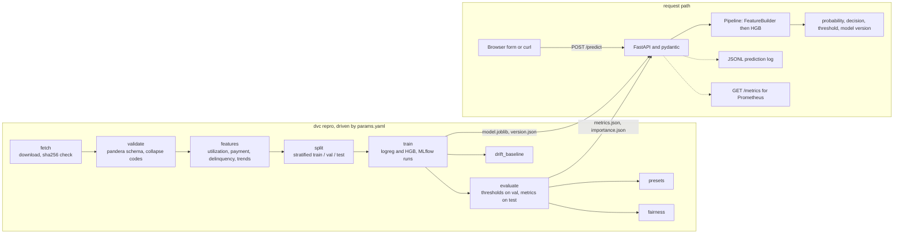

# credit-risk-service

[](https://github.com/Zulqarnain-10/credit-risk-service/actions/workflows/ci.yml)
[](https://github.com/Zulqarnain-10/credit-risk-service/actions/workflows/cd.yml)
[](LICENSE)


A credit-default risk model shipped like a product: versioned data, tracked experiments, a tested
API, CI/CD, a live endpoint, and drift monitoring.

A notebook proves that a model can be trained once. This repository proves the rest. The raw
download is fetched and checked by hash, every step is a DVC stage, both candidate models are
logged to MLflow, the winner sits behind a FastAPI endpoint with tests, the container builds and
deploys from GitHub Actions, and a CI job rebuilds the whole pipeline from scratch to check the
numbers printed in this file.

Demonstration system trained on the 2005 Taiwan credit-card dataset (UCI id 350). Not a U.S.
underwriting model. Do not use it for real credit decisions. The same sentence travels with every
prediction the API returns.

## Live demo and one-command run

Live endpoint: [todo: live URL after first deploy]. The demo runs on a free Hugging Face Space;
free Spaces sleep after a period of inactivity and take a few seconds to wake.

Run the same service on your machine with one command:

```
docker run -p 8000:8000 ghcr.io/zulqarnain-10/credit-risk-service:latest
```

Then open http://127.0.0.1:8000 for the demo page, /docs for the OpenAPI schema, /version for the
receipts as JSON, and /metrics for Prometheus. The image is published by the Deploy workflow on
every green push to main.

## The problem

Given six months of a cardholder's statements and repayment history, estimate the probability
that the next payment is missed, and turn that probability into a decision at a documented
threshold. The data is the public UCI "Default of Credit Card Clients" set: 30,000 rows, 23
attributes, one binary label with a 0.2212 positive rate (CC BY 4.0, Yeh and Lien 2009;
source, citation, hashes, and quirks in [data/DATA_CARD.md](data/DATA_CARD.md)).

## Approach

The pipeline is nine DVC stages driven by `params.yaml`. The model is one scikit-learn
`Pipeline`: a stateless `FeatureBuilder` that turns the 21 raw inputs into 45 features
(utilization ratios, payment-to-bill ratios, delinquency depth and recency, bill and payment
trends), followed by a `HistGradientBoostingClassifier` (HistGradientBoosting, HGB below). A
logistic-regression baseline is trained alongside it; the higher validation ROC-AUC ships. `SEX`
and `MARRIAGE` are never model inputs. Thresholds are chosen on the validation split; every
headline number is measured once on the untouched test split.



## Results

The block below is written by `python -m credit_risk.sync_readme` from the report files, and
`python -m credit_risk.sync_readme --check` fails whenever the two disagree. Nothing in it is
typed by hand.

<!-- metrics:start -->
<!-- Generated by python -m credit_risk.sync_readme from reports/*.json and models/version.json. Edit those files, not this block. -->
Held-out test split, n = 6,000, positive rate 0.2212. Nothing below was tuned on it.

| Metric | HGB (this model) | Logistic baseline |
|---|---|---|
| ROC-AUC | 0.7909 | 0.7672 |
| PR-AUC (average precision) | 0.5744 | 0.5219 |
| Brier score (lower is better) | 0.1316 | 0.1386 |
| KS statistic | 0.4495 | 0.4239 |

Threshold policy, chosen on the validation split and then applied unchanged to test:

| Policy | Threshold | Precision | Recall | Selection rate |
|---|---|---|---|---|
| Cost-optimal, the API default (5:1 cost matrix, illustrative) | 0.155 | 0.3667 | 0.7905 | 0.4768 |
| Precision target 0.60 | 0.365 | 0.6144 | 0.4574 | 0.1647 |

Latency: p95 763.85 ms for POST /predict, 300 requests at concurrency 10, on local uvicorn, Windows 11, Python 3.12, single process (reports/loadtest.json).

Fairness at the cost-optimal threshold, from held-out labels: demographic parity ratio 0.9234 by sex and 0.7887 by age band (reports/fairness.json).

Provenance: trained 2026-09-02T17:05:32Z, git 412322f, data sha256 56c885f84457, rows 18,000 train / 6,000 validation / 6,000 test (models/version.json).
<!-- metrics:end -->

Figures: [ROC](reports/figures/roc.png), [precision-recall](reports/figures/pr.png),
[calibration](reports/figures/calibration.png), [permutation importance](reports/figures/importance.png).
The full metric set, calibration table, fairness tables, and top drivers are in
[models/MODEL_CARD.md](models/MODEL_CARD.md).

## Receipts

Every public number has a file and a command behind it. [docs/PROOF.md](docs/PROOF.md) maps each
one individually; this table is the short version.

| Numbers | File | Produced by |
|---|---|---|
| ROC-AUC, PR-AUC, Brier, KS, thresholds, confusion blocks, calibration, baseline | [reports/metrics.json](reports/metrics.json) | `python -m credit_risk.evaluate` (stage `evaluate`) |
| Permutation importance, top drivers on the demo page | [reports/importance.json](reports/importance.json) | `python -m credit_risk.evaluate` (stage `evaluate`) |
| Selection rate, TPR, FPR by sex and age band | [reports/fairness.json](reports/fairness.json) | `python -m credit_risk.fairness` (stage `fairness`) |
| Latency percentiles, throughput, error rate | [reports/loadtest.json](reports/loadtest.json) | `python -m credit_risk.loadtest --url http://127.0.0.1:8000 --requests 300 --concurrency 10 --host "..."` |
| Drift scores, PSI per feature | [reports/drift_summary.json](reports/drift_summary.json), [reports/drift_report.html](reports/drift_report.html) | `python -m credit_risk.monitoring drift` |
| Model version, git sha, MLflow run ids, data hash, library versions | [models/version.json](models/version.json) | `python -m credit_risk.train` (stage `train`) |
| The three demo applicants and their scores | [configs/presets.json](configs/presets.json) | `python -m credit_risk.presets` (stage `presets`) |
| Row counts and positive rate per split | `data/processed/splits/split_manifest.json` (rebuilt by `dvc repro`, not committed; copied into the [data card](data/DATA_CARD.md)) | `python -m credit_risk.split` (stage `split`) |

CI run that reproduced these numbers: [todo: CI run link after first push].

## Stack

Python 3.12, pandas, scikit-learn (`HistGradientBoostingClassifier`, `LogisticRegression`),
pandera for the raw-data schema, DVC for the pipeline, MLflow for experiment tracking and the
model registry, FastAPI with pydantic v2 and uvicorn for serving, prometheus-fastapi-instrumentator
for `/metrics`, Evidently for the drift report, pytest and ruff, pre-commit with gitleaks, a
multi-stage non-root Docker image on `python:3.12-slim`, GitHub Actions for CI and CD, GHCR for
the image, Hugging Face Spaces for the live endpoint. Exact serving versions are pinned in
[requirements.txt](requirements.txt); pipeline and dev extras in the two files next to it.

## Run it locally

Three commands in PowerShell (on macOS or Linux, swap the activation for
`source .venv/bin/activate`):

```powershell
python -m venv .venv; .\.venv\Scripts\Activate.ps1; python -m pip install -r requirements-dev.txt -e .
python -m dvc repro
python -m credit_risk.api
```

If PowerShell refuses to run `Activate.ps1`, run `Set-ExecutionPolicy -Scope Process RemoteSigned`
first; it applies to that window only. Keep the clone path short (for example
`C:\src\credit-risk-service`) or enable Windows long paths before `dvc repro`, because DVC's run
cache nests deep paths that otherwise cross the 260-character limit.

`dvc repro` downloads the UCI archive (internet needed once), verifies both hashes, and runs the
nine stages end to end; the stage commands call plain `python`, so keep the venv activated. The
API then serves http://127.0.0.1:8000. Useful extras:

```powershell
python -m pytest                                   # tests with coverage
python -m ruff check .; python -m ruff format --check .
$env:MLFLOW_ALLOW_FILE_STORE = "true"; python -m mlflow ui --backend-store-uri file:./mlruns
docker compose up                                  # the API from the local Dockerfile
python -m credit_risk.predict --input rows.csv --output scored.csv   # batch scoring
```

MLflow 3 keeps its filesystem backend behind that environment variable; `train.py` sets it for
you, the UI command does not.

## Run it yourself

The payload is the first demo preset, a real held-out applicant from
[configs/presets.json](configs/presets.json). Against this model it returns probability 0.0526 and
`unlikely_default` at the cost-optimal threshold.

```bash
curl -X POST http://127.0.0.1:8000/predict -H "Content-Type: application/json" -d '{
  "limit_bal": 280000, "education": 1, "age": 28,
  "pay_0": -2, "pay_2": -2, "pay_3": -2, "pay_4": -2, "pay_5": -2, "pay_6": -2,
  "bill_amt1": 10296, "bill_amt2": 1820, "bill_amt3": 0, "bill_amt4": 5970, "bill_amt5": 8628, "bill_amt6": 2036,
  "pay_amt1": 3543, "pay_amt2": 1195, "pay_amt3": 5970, "pay_amt4": 8628, "pay_amt5": 2306, "pay_amt6": 768
}'
```

In PowerShell, where `curl` is an alias, use `curl.exe` or:

```powershell
$body = '{"limit_bal": 280000, "education": 1, "age": 28, "pay_0": -2, "pay_2": -2, "pay_3": -2, "pay_4": -2, "pay_5": -2, "pay_6": -2, "bill_amt1": 10296, "bill_amt2": 1820, "bill_amt3": 0, "bill_amt4": 5970, "bill_amt5": 8628, "bill_amt6": 2036, "pay_amt1": 3543, "pay_amt2": 1195, "pay_amt3": 5970, "pay_amt4": 8628, "pay_amt5": 2306, "pay_amt6": 768}'
Invoke-RestMethod -Method Post -Uri http://127.0.0.1:8000/predict -ContentType "application/json" -Body $body
```

`POST /predict/batch` takes `{"items": [...]}` with 1 to 100 applicants. Unknown fields and
out-of-range values return a 422 with FastAPI's standard detail list.

## Monitoring and retraining

`GET /metrics` exposes request counts, a latency histogram, and error counts from
prometheus-fastapi-instrumentator, plus `credit_risk_predictions_total{decision=...}`. A minimal
scrape configuration:

```yaml
scrape_configs:
  - job_name: credit-risk-service
    static_configs:
      - targets: ["127.0.0.1:8000"]
```

Every prediction is appended as one JSON line to `PREDICTION_LOG_PATH` (default: a file in the
system temp directory). On a free Space that file is ephemeral and disappears when the Space
restarts; treat it as a demonstration of the mechanism, not as storage.

Drift has two tools. `python -m credit_risk.monitoring drift` builds an Evidently report with the
training split as reference and a "Simulated production batch" as current: the test split with
the perturbation declared in `params.yaml` (credit limits scaled by 0.85, ages shifted by 4 years,
bills scaled by 1.25, 15 percent of rows moved one repayment-status step later). The count of
drifted columns, the dataset-drift verdict, and the PSI of the model score and of each key feature
against the training histograms are written to
[reports/drift_summary.json](reports/drift_summary.json) and rendered in
[reports/drift_report.html](reports/drift_report.html); the numbers live there, not here.
`python -m credit_risk.monitoring psi --log <predictions.jsonl>` computes the same PSI on a real
prediction log against `reports/drift_baseline.json`.

Retraining: change `params.yaml` and run `dvc repro`; only the stages whose inputs changed
re-run, and `python -m credit_risk.sync_readme` refreshes this file. On GitHub, the manual
Retrain workflow ([.github/workflows/retrain.yml](.github/workflows/retrain.yml)) rebuilds the
pipeline on a runner, refreshes the block above, and opens a pull request with the model, the
reports, and this file, so nothing lands on main without review. That pull request is opened with
the workflow's own `GITHUB_TOKEN`, which needs the repository setting "Allow GitHub Actions to
create and approve pull requests" switched on, and GitHub does not start CI on it until a commit
is pushed to its branch or it is closed and reopened. CI's reproduce job re-runs the pipeline from
the raw download on every push and fails if any metric differs from the committed report by more
than 0.005.

## Limitations and next steps

- One issuer, one country, one snapshot (Taiwan, April to September 2005). Nothing here
  transfers to another market without re-estimation. It is a demonstration system.
- The split is random and stratified, not time-based, so the metrics say nothing about decay
  over time. The drift tooling simulates that instead of measuring it.
- The cost matrix is illustrative. Under the declared 5:1 costs the cost-optimal threshold flags
  0.4768 of test applicants; a different matrix gives a different operating point.
- `AGE` and `EDUCATION` stay in the model. The fairness report measures the resulting gaps by
  age band; the [model card](models/MODEL_CARD.md) explains the choice and what a real
  deployment would have to review.
- Latency was measured on a local uvicorn process on a Windows laptop, not on the Space. Between
  requests the laptop parks idle cores, so single requests run slower than the same model in a
  tight loop; the number is reported as measured. A live load test against the Space, an MLflow
  tracking server on DagsHub, and a time-based validation split are the next steps.

## About

Syed Zulqarnain Hassan, Data Scientist and AI/ML Engineer. I build models that ship, and this
repository is the runnable proof.

[zulqarnainhassan.com](https://zulqarnainhassan.com) ·
[GitHub](https://github.com/Zulqarnain-10) ·
[LinkedIn](https://www.linkedin.com/in/syedzulqarnainh)

Code is MIT licensed ([LICENSE](LICENSE)); the dataset is CC BY 4.0 from the UCI Machine Learning
Repository.
