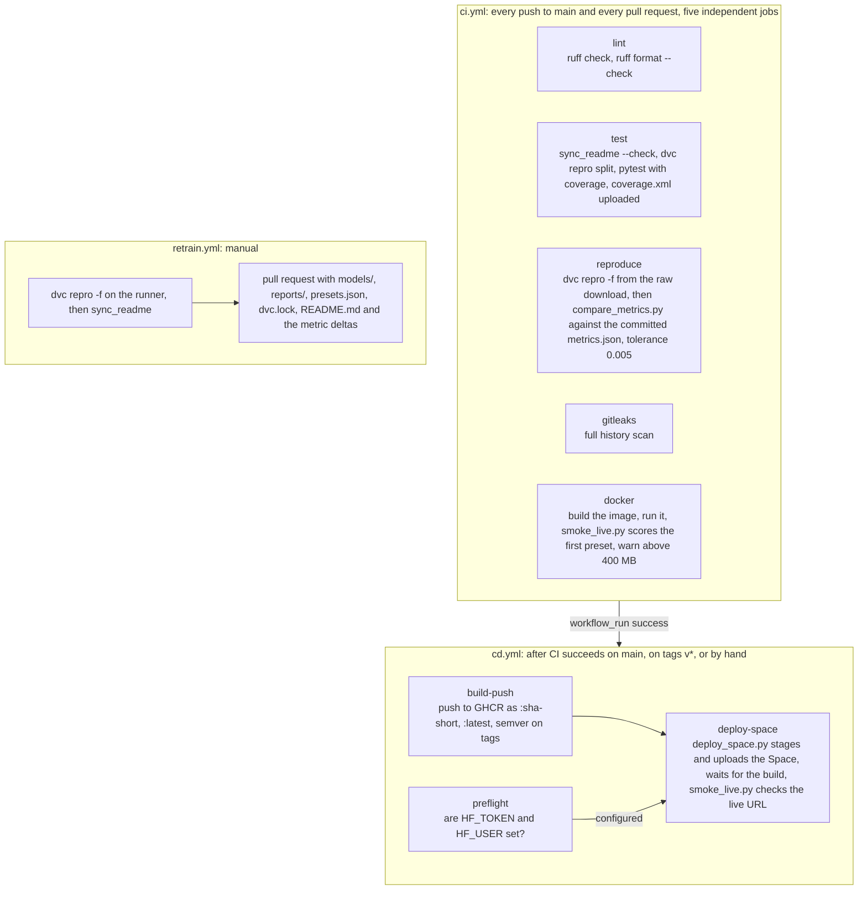

# Architecture

How `credit-risk-service` is put together: the components, the path a request takes, the path the
data takes, what is versioned where, what is thrown away, and how the two GitHub workflows fit.
Numbers on this page come from the report files named next to them.

## Components

| Component | Where | Role |
|---|---|---|
| Parameters | `params.yaml` | Single source of every stage setting: data hashes, split seed, model hyperparameters, cost matrix, drift perturbation. |
| Settings | `src/credit_risk/settings.py` | Paths (resolved from `CREDIT_RISK_HOME` or the folder holding `params.yaml`), column contracts, field ranges, the disclaimer. No secrets. |
| Pipeline stages | `src/credit_risk/{data,validate,features,split,train,evaluate,presets,fairness,monitoring}.py` | One module per DVC stage, each runnable as `python -m credit_risk.<module>`. |
| Feature builder | `src/credit_risk/features.py` | `build_features` (pure function) and `FeatureBuilder` (stateless sklearn transformer). The first step of the shipped `Pipeline`. |
| Model artifacts | `models/model.joblib`, `models/baseline_logreg.joblib`, `models/version.json` | The winner, the baseline, and the provenance record. |
| Reports | `reports/*.json`, `reports/figures/*.png`, `reports/drift_report.html` | Every public number. |
| API | `src/credit_risk/api/` | FastAPI app, pydantic schemas, model loader, uvicorn entry point, demo page. |
| Demo page | `src/credit_risk/api/static/index.html`, `style.css` | One HTML file, one CSS file, vanilla JS that reads `/version`, `/presets`, `/importance` and posts to `/predict`. |
| Batch CLI | `src/credit_risk/predict.py` | Scores a CSV of raw inputs with the same pipeline. |
| Monitoring | `src/credit_risk/monitoring.py`, `src/credit_risk/loadtest.py` | Reference histograms, Evidently drift report, PSI on a prediction log, load test. |
| Sync | `src/credit_risk/sync_readme.py` | Renders the metrics block in `README.md` from the reports; `--check` fails when they disagree. |
| Container | `Dockerfile`, `docker-compose.yml` | Multi-stage build on `python:3.12-slim`, non-root user `app`, `HEALTHCHECK` on `/health`. |
| Workflows | `.github/workflows/ci.yml`, `cd.yml`, `retrain.yml` | Lint, test, reproduce, secrets scan, image build; publish and deploy; manual retrain. |
| Deploy scripts | `scripts/deploy_space.py`, `scripts/smoke_live.py`, `scripts/compare_metrics.py` | Stage and push the Space, smoke-test a live URL, compare two `metrics.json` files. |

## Request path

1. The browser loads `GET /`, which returns `static/index.html`. The page fetches `/version`
   (provenance, headline metrics, the load-test block when present), `/presets` (three real
   held-out applicants), and `/importance` (top drivers). Anything the API cannot supply renders
   as a `[todo]` chip; the page never hard-codes a number.
2. The form posts JSON to `POST /predict`. Pydantic validates the 21 fields against the ranges in
   `settings.FIELD_RANGES` with `extra="forbid"`, so a typo in a field name is a 422, not a
   silently dropped input. `POST /predict/batch` accepts 1 to 100 applicants.
3. `applicants_to_frame` builds a one-row DataFrame in `MODEL_INPUT_COLUMNS` order.
   `ModelBundle.predict_proba` runs the sklearn `Pipeline`: `FeatureBuilder` appends the
   engineered columns, `HistGradientBoostingClassifier` returns the probability.
4. The decision compares the probability with `threshold_cost_optimal` read once from
   `reports/metrics.json` at startup. The response carries probability (4 dp), threshold,
   decision, a sentence-case label, model name, model version, and the disclaimer.
5. Side effects: the `credit_risk_predictions_total{decision}` counter increments; one JSON line
   with timestamp, model version, probability, decision, and inputs is appended to
   `PREDICTION_LOG_PATH`. A failed log write is a warning, never an error for the caller.
6. Logging is structured JSON from `configs/logging.yaml` (uvicorn access logs are silenced to
   keep the stream clean). `GET /metrics` is exposed by prometheus-fastapi-instrumentator with
   request count, latency histogram, and error count per handler.

The model, `version.json`, `metrics.json`, `presets.json`, and `importance.json` load once in the
FastAPI lifespan handler. `loadtest.json` is re-read per `/version` call so a fresh load test shows
without a restart.

## Data flow through the DVC stages

| Stage | Reads | Writes | Notes |
|---|---|---|---|
| `fetch` | `params.data` | `data/raw/credit_default_raw.csv` (plus the zip, the xls, and a fetch manifest) | Downloads the UCI archive, verifies the zip and xls sha256 values, retries three times, falls back to `ucimlrepo`. |
| `validate` | raw CSV | `data/processed/validated.csv` | pandera `RAW_SCHEMA`: types, ranges, unique `ID`, no nulls. Collapses undocumented `EDUCATION` and `MARRIAGE` codes. |
| `features` | validated CSV | `data/processed/features.csv` | Appends the engineered columns. Pure, vectorized, no fitting. |
| `split` | features CSV | `train.csv`, `val.csv`, `test.csv`, `split_manifest.json` | Stratified 60/20/20 with seed 42; the manifest records sizes, positive rates, and a hash of each ID list. |
| `train` | train and val splits | `model.joblib`, `baseline_logreg.joblib`, `version.json` | Fits logreg and HGB, scores both on validation, logs two MLflow runs, registers the winner. |
| `evaluate` | both models, val and test splits | `metrics.json`, `importance.json`, four figures | Thresholds on validation; every headline metric on test; permutation importance on validation. |
| `presets` | model, metrics, test split | `configs/presets.json` | Three real test rows at the 10th percentile, the threshold, and the 95th percentile of score. |
| `fairness` | model, metrics, test split | `fairness.json` | Selection rate, TPR, FPR, precision by sex and age band, from labels and attributes that are not inputs. |
| `drift_baseline` | model, train split | `drift_baseline.json` | Ten quantile bins for the score and eleven key features, the reference for PSI. |

`SEX` and `MARRIAGE` travel through the split files so the fairness stage can read them, and stop
there. `FeatureBuilder` selects only `MODEL_INPUT_COLUMNS`, so extra columns never reach the
estimator; a contract test asserts that no feature name in the fitted pipeline mentions either
attribute, and another that adding `SEX` and `MARRIAGE` columns to a request leaves every
prediction unchanged.

## What is versioned where

| Artifact | git | DVC cache | MLflow | Docker image | Space |
|---|---|---|---|---|---|
| Source, tests, workflows, `params.yaml`, `dvc.yaml`, `dvc.lock` | yes | | | package only | package only |
| Raw and processed data, split CSVs | no (gitignored) | yes, local `.dvc/cache`, no remote | | | |
| Split manifest `data/processed/splits/split_manifest.json` | no (gitignored under `data/processed/`) | no (`cache: false`); rebuilt by `dvc repro`, its md5 recorded in `dvc.lock`, and copied into `data/DATA_CARD.md` | | | |
| `models/model.joblib`, `baseline_logreg.joblib`, `version.json` | yes (`cache: false` outs) | | run artifacts and logged models | `model.joblib`, `version.json` | same as image |
| `reports/*.json`, figures, `drift_report.html` | yes (`cache: false` outs) | | validation metrics and curves per run | `metrics.json`, `importance.json`, `loadtest.json` if present | same as image |
| `configs/presets.json`, `configs/logging.yaml` | yes | | | yes | yes |
| MLflow runs and the `credit-risk` registered model | no (`mlruns/` gitignored) | | `file:./mlruns` on the machine that trained | | |
| Container image | | | | GHCR `:sha-<short>`, `:latest`, semver tags on `v*` | built again by the Space from the staged Dockerfile |
| Space README with Hugging Face front matter | never | | | | written by `deploy_space.py` into `.space_build/` |

There is no DVC remote. `fetch` is deterministic and hash-checked, so a clean clone rebuilds every
DVC output with `dvc repro`. A remote can be added later without changing any stage.

## What is ephemeral

- The prediction log. It lives at `PREDICTION_LOG_PATH`, by default in the system temp directory,
  and on a free Space it vanishes on restart.
- The Space filesystem. Each deploy uploads the staged folder with delete patterns, and the Space
  rebuilds the image; nothing written at runtime survives.
- `mlruns/` on CI. The reproduce job trains with `MLFLOW_TRACKING_URI=file:./mlruns` and uploads
  `reports/`, `models/version.json`, and `configs/presets.json` as a workflow artifact; the MLflow
  store itself is discarded with the runner.
- `.space_build/`, the GitHub Actions build cache, and coverage output.

## CI and CD

The reproduce job is the receipt behind the README: it starts from nothing but the source and the
UCI download, rebuilds `reports/metrics.json`, and fails the build if any numeric leaf differs
from the committed file by more than 0.005 (relative to magnitude for values above 1; identity
fields such as `trained_at`, `git_sha`, and `mlflow_run_id` are ignored; row counts and the data
hash must match exactly). The test job checks the README metrics block against the reports with
`python -m credit_risk.sync_readme --check`, builds the data splits on the runner with
`python -m dvc repro split`, and then runs pytest, so the model-contract tests re-score the shipped
model instead of skipping. The Space deploy is skipped, with a notice rather than a failure, until
the repository secret `HF_TOKEN` and the repository variable `HF_USER` exist. The retrain pull
request is opened with the workflow's own `GITHUB_TOKEN`: that needs the repository setting "Allow
GitHub Actions to create and approve pull requests", and GitHub does not start CI on such a pull
request until a commit is pushed to its branch or it is closed and reopened.

## Why these choices

- HGB over LightGBM. `HistGradientBoostingClassifier` is already in scikit-learn, supports early
  stopping, and handles 45 numeric features in well under a minute, so the serving image needs
  no extra compiled dependency. LightGBM was not benchmarked in the recorded run; it would have
  to beat HGB by a margin worth an extra compiled dependency.
- File-store MLflow. `file:./mlruns` needs no server, no database, and no credentials, runs on a
  CI runner, and still gives per-run params, metrics, artifacts, and a registered model. MLflow 3
  gates it behind `MLFLOW_ALLOW_FILE_STORE`, which `train.py` sets. A hosted tracker (DagsHub) can
  replace it by setting `MLFLOW_TRACKING_URI`.
- GHCR. Free, authenticated with the workflow's own `GITHUB_TOKEN`, and it gives any reader a
  `docker run` line that needs no account.
- Hugging Face Spaces. A Docker host with a stable URL; the Space sleeps and takes a few seconds
  to wake, which the README says next to the link. Docker Spaces now require a paid Hugging Face
  plan, so `render.yaml` (a free Render web service) is the documented fallback.
- No Kubernetes. One process, one container, one model file. A single container is the honest
  scale of this service, and a cluster would add operational surface without adding proof.
- Thresholds from `params.yaml`, not from code. The cost matrix is declared, labeled
  illustrative, and changing it re-runs exactly the stages that depend on it.
